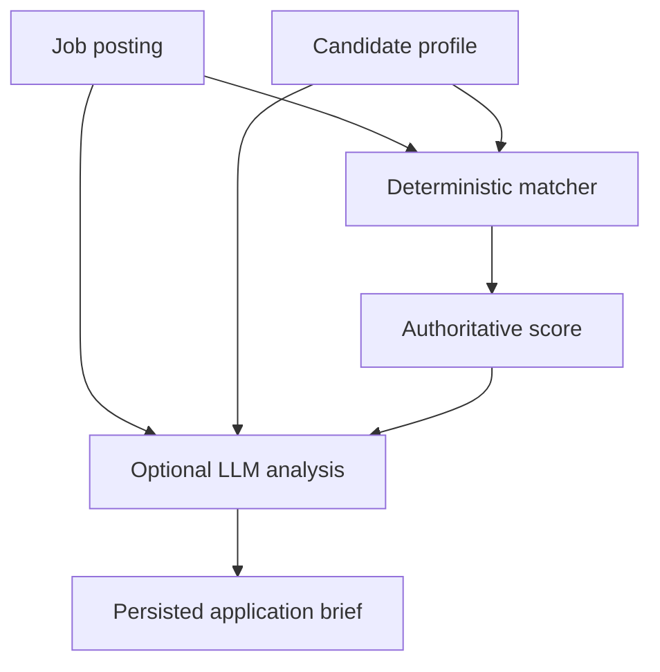

# JobRadar AI

JobRadar AI is a portfolio-grade Python backend for reviewing vacancies.
It stores canonical vacancies in PostgreSQL, compares them with each
authenticated user's database-backed candidate profile, and produces an
explainable deterministic match. Optional AI assistance can extract a vacancy
from text and prepare a screening result.

No API key is required for deterministic matching or Grade 0 imports.

## Roadmap

- [x] FastAPI application
- [x] PostgreSQL persistence
- [x] Async SQLAlchemy
- [x] Candidate profile configuration
- [x] Deterministic job matching
- [x] Automated tests
- [x] Alembic migrations
- [x] Docker Compose
- [x] LLM-assisted job analysis
- [x] Canonical vacancy normalization and provenance
- [x] Smart vacancy import and graded assessment
- [ ] Telegram notifications
- [ ] Automated job-source adapters
- [ ] Prometheus metrics
- [ ] Production deployment

## Running with Docker

The supported development runtime is Docker Compose with PostgreSQL. From a
clean clone:

```bash
cp .env.example .env
docker compose up --build
```

The API container applies `alembic upgrade head` before starting Uvicorn. If a
migration fails, the API container exits and exposes the failure in its logs.

Swagger UI is available at `http://localhost:8000/docs`. The health check is
`http://localhost:8000/health`.

For a local database extension, connect to `127.0.0.1:5433`. Port `5432` is
inside the Docker network; `5433` is the intentionally exposed host port.

PostgreSQL data is stored in the named `postgres_data` Docker volume, so it
survives normal container restarts and `docker compose down`. To permanently
reset all local data, stop the stack and delete that volume:

```bash
docker compose down -v
```

## Running without Docker

This is useful when you already have a local PostgreSQL server. Create `.env`
from the example, change its host from `db` to `localhost` if necessary, and
then run:

```bash
python3.12 -m venv .venv
source .venv/bin/activate
pip install -e ".[dev]"
cp .env.example .env
uvicorn app.main:app --reload
```

Swagger UI is available at `http://127.0.0.1:8000/docs`. The health check is
available at `http://127.0.0.1:8000/health`.

Before launching the app, apply the database schema:

```bash
alembic upgrade head
```

`DATABASE_URL` supplies the async PostgreSQL connection, for example:
`postgresql+asyncpg://jobradar:jobradar@db:5432/jobradar` in Docker Compose.

## Alembic migrations

Alembic is the only production schema-management mechanism. Useful commands:

```bash
alembic upgrade head
alembic downgrade -1
alembic revision --autogenerate -m "description"
```

For the Docker stack, invoke Alembic inside the API container if needed:

```bash
docker compose exec api alembic upgrade head
docker compose exec api alembic downgrade -1
docker compose exec api alembic revision --autogenerate -m "description"
```

## API overview

- `GET /health` — service health check.
- `POST /api/v1/auth/register` and `POST /api/v1/auth/login` — create an
  account and obtain a bearer token.
- `GET` / `PUT /api/v1/me/profile` — read or update the authenticated profile.
- `POST /api/v1/jobs/import` — the normal workflow for text, JSON, or URL
  vacancy imports.
- `GET /api/v1/jobs/review-list` — review a user's imported vacancies.
- `GET /api/v1/jobs/{job_id}/review` — see the vacancy, match, and latest
  assessment together.

The lower-level job endpoints remain useful for development and debugging:

- `POST /api/v1/jobs` — create a structured job posting manually.
- `GET /api/v1/jobs?limit=20&offset=0` — list a user's stored jobs.
- `GET /api/v1/jobs/{job_id}` — retrieve one associated job.
- `POST /api/v1/jobs/{job_id}/match` — create a deterministic match.

### Add a structured vacancy through Swagger

1. Open `/docs`, expand `POST /api/v1/jobs`, select **Try it out**, and use:

```json
{
  "company": "Acme",
  "title": "Senior Python Backend Developer",
  "description": "Build and maintain reliable backend APIs.",
  "url": "https://example.com/jobs/python-backend",
  "location": "Remote",
  "remote": true,
  "employment_type": "full-time",
  "salary_min": 3500,
  "salary_max": 5000,
  "currency": "EUR",
  "required_skills": ["Python", "FastAPI", "PostgreSQL", "Docker", "Redis"]
}
```

2. Select **Execute** and copy the returned `id`.
3. Expand `POST /api/v1/jobs/{job_id}/match`, enter that id, and select
   **Execute** to see the score and its explanation.

## Matching rules

Matching is deterministic: it calls no AI service and uses no hidden model.
The constants live at the top of `app/modules/matching/service.py`.

| Criterion | Maximum | Rule |
| --- | ---: | --- |
| Title relevance | 25 | A desired title is contained in the vacancy title. |
| Core skills | 40 | Proportional to candidate core skills listed by the vacancy. |
| Secondary skills | 20 | Proportional to candidate secondary skills listed by the vacancy. |
| Remote/location | 15 | Remote fits the preference, or the location is preferred. |

Recommendations are `strong_apply` (80–100), `apply` (60–79), `maybe`
(40–59), and `skip` (0–39).

## Authentication

Create an account with `POST /api/v1/auth/register`, then obtain a bearer token
through `POST /api/v1/auth/login`. In Swagger (`/docs`), click **Authorize**
and enter `Bearer <access_token>`. Private jobs, profiles, matches, and
analyses are scoped to the token's user.

```json
{"email":"candidate@example.com","password":"password123"}
```

Manage the authenticated profile with `PUT /api/v1/me/profile`. The
`candidate.example.yaml` file is now documentation/example input only; runtime
matching reads the database-backed profile.

## Vacancy normalization

Manual vacancy creation uses the same deterministic pipeline planned for future
sources:

```text
ManualJobCreate → RawJobData → JobNormalizer → JobPosting + JobSourceRecord
```

`JobPosting` is canonical. `JobSourceRecord` holds source provenance.
`application_url` is the employer application destination, while
`JobSourceRecord.source_url` is the page where JobRadar discovered the vacancy.
Future sources may create several provenance records for one canonical job.

Legacy request fields `url`, `location`, `remote`, and `currency` are accepted
only at the API boundary. They are converted to `application_url`,
`location_text`, `work_mode`, and `salary_currency`. Supported work modes are
`remote`, `hybrid`, `onsite`, and `unknown`. Ambiguous salary text is preserved
as raw data with a warning rather than guessed.

## LLM-assisted analysis

Deterministic matching remains the source of truth for the score and its
recommendation. Optional LLM analysis adds a structured application brief:
strengths, gaps, factual CV emphasis, a recruiter message, and interview
preparation topics. It never replaces or recalculates the deterministic score.



LLM support is disabled by default, so no API key is needed to start the
project. When disabled, all existing endpoints continue working and
`POST /api/v1/jobs/{job_id}/analyze` returns a clear `503` response without
changing job or matching data.

### Fake provider for local development

Set these values in `.env`, then rebuild the API container:

```dotenv
LLM_ENABLED=true
LLM_PROVIDER=fake
```

```bash
docker compose up --build -d
```

Create a job in Swagger, run `/match` if you want to inspect the authoritative
score, then call `POST /api/v1/jobs/{job_id}/analyze`. The fake provider uses
no network or credentials and persists a structured history record. Retrieve
history through `GET /api/v1/analyses` or `GET /api/v1/analyses/{analysis_id}`.

### Future OpenAI-compatible provider

Use a provider only when you have an appropriate endpoint and secret outside
version control:

```dotenv
LLM_ENABLED=true
LLM_PROVIDER=openai_compatible
LLM_BASE_URL=https://provider.example/v1
LLM_API_KEY=replace-with-your-secret
LLM_MODEL=provider-model-name
LLM_TIMEOUT_SECONDS=30
LLM_MAX_RETRIES=2
```

The adapter retries only timeouts, network failures, HTTP `429`, and HTTP
`5xx`, with bounded exponential backoff. Other HTTP failures, malformed JSON,
empty content, or invalid structured output return a controlled API error and
are never persisted. API keys and raw provider responses are neither logged
nor stored.

The prompt explicitly forbids fabricated candidate experience, employers,
years, achievements, metrics, certifications, or unlisted technologies. A job
requirement absent from the profile is reported as a gap instead.

## Smart vacancy import

The primary workflow is: “I already found vacancies. JobRadar reads them for
me.” Use `POST /api/v1/jobs/import` with `input_type` set to `text`, `json`, or
`url`. The endpoint extracts what is safely available, normalizes it, stores
the canonical job and provenance, creates a deterministic match, and optionally
creates an assessment in one request.

### Prepare pasted text for Swagger

Swagger requires valid JSON, so literal line breaks inside a JSON string cause
a `422 JSON decode error`. To prepare a pasted vacancy:

1. Open `POST /api/v1/tools/one-line-text`.
2. Select **Try it out** and choose the `text/plain` content type.
3. Paste the vacancy with its original paragraphs and lists.
4. Select **Execute**, then copy `text` from the response.
5. Paste that one-line value into the `text` field of
   `POST /api/v1/jobs/import`.

This utility requires no authentication, does not call AI, and does not store
the text.

For Grade 1+, deterministic extraction runs first and optional AI extraction
fills only missing, unstructured vacancy facts. AI extraction and candidate-fit
assessment are separate operations with separate prompt versions and usage
records. Grade 0 never calls AI.

Grade 0 is deterministic only. Grade 1 screens whether a vacancy is worth the
user's time, Grade 2 adds application guidance, and Grade 3 adds interview
preparation. Models and reasoning settings are configured with the
`AI_GRADE*_MODEL` and `AI_GRADE*_REASONING` variables. Fake mode
(`LLM_ENABLED=true`, `LLM_PROVIDER=fake`) supports all grades offline.

If AI fails, the imported job and deterministic match remain available; the
response contains a warning. Retry with
`POST /api/v1/jobs/{job_id}/assess?grade=1|2|3`. Use
`GET /api/v1/jobs/{job_id}/review` for the vacancy, provenance, latest match,
and latest assessment together.

Use `GET /api/v1/jobs/review-list?sort=newest` to review many imports, or
`sort=score_desc` to prefer the latest AI fit score when one exists and fall
back to the latest deterministic score. Each row exposes both scores, verdicts,
requirement counts, blockers, canonical location/work mode, salary summary,
and import time.

Skills and broader requirements are intentionally distinct: required/preferred
skills are explicit technologies (for example, Python or AWS); hard/preferred
requirements are non-skill conditions (for example, 3+ years of experience,
language, authorization, or degree requirements). Review combines both groups
instead of duplicating a skill in two fields.

Salary normalization supports deterministic, unambiguous forms including
`€2,000-2,800`, `$3,500-$5,000`, `2500 EUR`, and `€2k-2.8k`. Ambiguous forms
remain unknown. Title matching uses meaningful job-family tokens, including a
small `developer`/`engineer` equivalence; backend, frontend, data, devops,
mobile, and technology terms still prevent false equivalence.

URL imports accept only public HTTP(S), reject private/loopback/link-local and
metadata addresses, revalidate redirects, limit redirects and response size,
and never execute JavaScript or bypass authentication. If a page cannot be
fetched, paste its visible text instead.

## Candidate profile

`candidate.example.yaml` is deliberately fictional reference data. Runtime
matching uses the authenticated user's PostgreSQL-backed profile, managed with
`PUT /api/v1/me/profile`. Do not commit private data.

## Quality checks

```bash
pytest
ruff check .
```

CI runs these checks against a PostgreSQL GitHub Actions service container on
every push and pull request to `main`.

## Project map

- `app/main.py` wires the FastAPI app and routes.
- `app/core/database.py` owns the async PostgreSQL engine and session lifecycle.
- `app/modules/jobs/` validates, normalizes, persists, and serves vacancies.
- `app/modules/candidate/` manages database-backed candidate profiles.
- `app/modules/matching/service.py` contains all scoring rules.
- `app/integrations/llm/` isolates optional provider adapters and prompt rules.
- `app/modules/analysis/` validates and persists successful analysis history.
